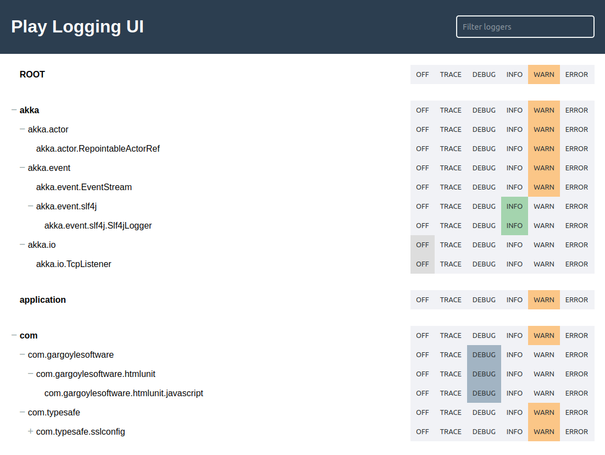

# play-logging-ui

A play module to update the level of loggers during runtime with a simple ui.




## Installation

Add `play-logging-ui` to the dependencies in your `build.sbt` file
```scala
libraryDependencies ++= Seq(
  "com.github.luhuec" % "play-logging-ui" % "0.0.4"
)
```

Import `playloggingui.Routes` into your `routes` file 
```scala
->    /         playloggingui.Routes
```

The UI is available under `http://localhost:9000/playloggingui`

### Import with base path

You can import the routes with a basepath such as `/admin`
```scala
->    /admin    playloggingui.Routes
```

Now the UI is available under `http://localhost:9000/admin/playloggingui`
